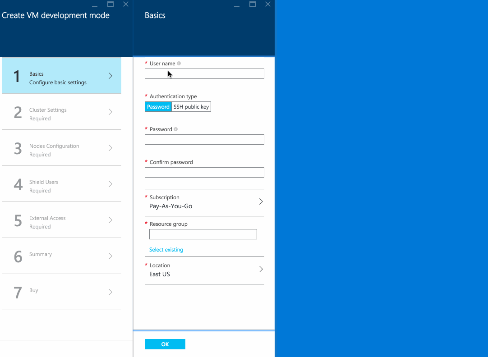

# Elasticsearch Azure Marketplace offering

This repository consists of:

* [src/mainTemplate.json](src/mainTemplate.json) - The main Azure Resource Management (ARM) template. The template itself is composed of many nested linked templates with the main template acting as the entry point.
* [src/createUiDefinition](src/createUiDefinition.json) - UI definition file for our Azure Marketplace offering. This file produces an output JSON that the ARM template can accept as input parameters.

## Building

After pulling call `npm install` once, this will pull in all devDependencies.

You may edit [build/allowedValues.json](build/allowedValues.json), which the build will use these to patch the arm template and ui definition.

Run `npm run build`, this will validate EditorConfig settings, validate JSON files, patch the allowedValues and then create a zip in the `dist` folder.

## Azure Marketplace

The Azure Marketplace Elasticsearch offering offers a simplified UI over the full power of the ARM template. 

It will always bootstrap a cluster complete with [x-pack](https://www.elastic.co/products/x-pack).

Did you know that you can apply for a free basic license? Go checkout our [subscription options](https://www.elastic.co/subscriptions)

Deploying through the Marketplace is great and easy way to get your feet wet for a first time with Elasticsearch (on azure) but in the long run you'll want to deploy 
the templates directly though the Azure CLI. For examples of this keep reading this document!

---

### VERY IMPORTANT
**This template does not configure SSL/TLS for communication with Kibana, or Elasticsearch through an external load balancer. It is strongly recommended that you secure
communication before using in production.**

---



You can view the UI in developer mode by [clicking here](https://portal.azure.com/#blade/Microsoft_Azure_Compute/CreateMultiVmWizardBlade/internal_bladeCallId/anything/internal_bladeCallerParams/{"initialData":{},"providerConfig":{"createUiDefinition":"https%3A%2F%2Fraw.githubusercontent.com%2Felastic%2Fazure-marketplace%2Fmaster%2Fsrc%2FcreateUiDefinition.json"}}). If you feel something is cached improperly use [this client unoptimized link instead](https://portal.azure.com/?clientOptimizations=false#blade/Microsoft_Azure_Compute/CreateMultiVmWizardBlade/internal_bladeCallId/anything/internal_bladeCallerParams/{"initialData":{},"providerConfig":{"createUiDefinition":"https%3A%2F%2Fraw.githubusercontent.com%2Felastic%2Fazure-marketplace%2Fmaster%2Fsrc%2FcreateUiDefinition.json"}})

## Reporting bugs

Have a look at this [screenshot](images/error-output.png) to see how you can navigate to the deployment error status message.
Please create an issue with that message and in which resource it occured on our [github issues](https://github.com/elastic/azure-marketplace/issues) 

## ARM template

The output from the Azure Marketplace UI is fed directly to the ARM deployment template. You can use the ARM template on its own without going through the MarketPlace.

### Parameters

<table>
  <tr><th>Parameter</td><th>Type</th><th>Description</th></tr>

  <tr><td>artifactsBaseUrl</td><td>string</td>
    <td>The base url of the Elastic ARM template. Defaults to the raw content of the current branch.
    </td></tr>

  <tr><td>esVersion</td><td>string</td>
    <td>A valid supported Elasticsearch version see <a href="https://github.com/elastic/azure-marketplace/blob/master/src/mainTemplate.json#L15">this list for supported versions</a>
    </td></tr>

  <tr><td>esClusterName</td><td>string</td>
    <td> The name of the Elasticsearch cluster
    </td></tr>

  <tr><td>loadBalancerType</td><td>string</td>
    <td> The load balancer to set up to access the cluster. Can be <code>internal</code> or <code>external</code>. The default is <code>internal</code>. 
    By choosing <code>external</code>, both internal and external load balancers will be deployed. Kibana communicates with the cluster through the internal
    load balancer.
    <strong>If you are setting up Elasticsearch on an external endpoint, you will need to secure your nodes with a product like Elastic's Security as well as configure
    transport level security.</strong>
    </td></tr>

  <tr><td>azureCloudPlugin</td><td>string</td>
    <td>Either <code>Yes</code> or <code>No</code> to install the Azure Cloud plugin for snapshot/restore. 
    Defaults to <code>No</code>. when set to <code>Yes</code>, both <code>azureCloudeStorageAccountName</code> 
    and <code>azureCloudStorageAccountKey</code> should be specified to configure the plugin correctly.
    </td></tr>

  <tr><td>azureCloudStorageAccountName</td><td>string</td>
    <td> The name of an existing storage account to use for snapshots with Azure Cloud plugin. 
    Must be a valid Azure Storage Account name.
    </td></tr>

  <tr><td>azureCloudStorageAccountKey</td><td>securestring</td>
    <td> The access key of an existing storage account to use for snapshots with Azure Cloud plugin.
    </td></tr>

  <tr><td>esPlugins</td><td>string</td>
    <td>Either <code>Yes</code> or <code>No</code> to install a trial license of the commercial X-Pack
    plugins: Security, Watcher, Marvel and Graph (Elasticsearch 2.3.0+), or simply x-pack in 5.x
    </td></tr>

  <tr><td>esAdditionalPlugins</td><td>string</td>
    <td>Additional elasticsearch plugins to install.  Each plugin must be separated by a semicolon. e.g. analysis-icu;mapper-attachments
    </td></tr>

  <tr><td>kibana</td><td>string</td>
    <td>Either <code>Yes</code> or <code>No</code> provision an extra machine with a public IP that
    has Kibana installed on it. If you have opted to also install the Elasticsearch plugins using <code>esPlugins</code> then 
    a trial license of the commercial X-Pack Kibana plugins as well as <a href="https://www.elastic.co/guide/en/sense/current/introduction.html">Sense Editor</a> are also installed.
    </td></tr>

  <tr><td>vmSizeKibana</td><td>string</td>
    <td>Azure VM size of the Kibana instance. See <a href="https://github.com/elastic/azure-marketplace/blob/master/build/allowedValues.json">this list for supported sizes</a>.
    Defaults to <code>Standard_A1</code>.
    </td></tr>

  <tr><td>jumpbox</td><td>string</td>
    <td>Either <code>Yes</code> or <code>No</code> Optionally add a virtual machine to the deployment which you can use to connect and manage virtual machines on the internal network.
    </td></tr>

  <tr><td>vmHostNamePrefix</td><td>string</td>
    <td>The prefix to use for hostnames when naming virtual machines in the cluster. Hostnames are used for resolution of master nodes so if you are deploying a cluster into an existing virtual network containing an existing Elasticsearch cluster, be sure to set this to a unique prefix, to differentiate the hostnames of this cluster from an existing cluster. Can be up to 5 characters in length, must begin with an alphanumeric character and can contain alphanumeric and hyphen characters.
    </td></tr>

  <tr><td>vmSizeDataNodes</td><td>string</td>
    <td>Azure VM size of the data nodes. See <a href="https://github.com/elastic/azure-marketplace/blob/master/build/allowedValues.json">this list for supported sizes</a>
    </td></tr>

  <tr><td>vmDataNodeCount</td><td>int</td>
    <td>The number of data nodes you wish to deploy. Should be greater than 0. 
    Defaults to <code>3</code>.
    </td></tr>

  <tr><td>dataNodesAreMasterEligible</td><td>string</td>
    <td>Either <code>Yes</code> or <code>No</code> to make all data nodes master eligible. This can be useful for small Elasticsearch clusters however, for larger clusters it is recommended to have dedicated master nodes. 
    When <code>Yes</code> no dedicated master nodes will be provisioned.
    </td></tr>

  <tr><td>vmSizeMasterNodes</td><td>string</td>
    <td>Azure VM size of dedicated master nodes. See <a href="https://github.com/elastic/azure-marketplace/blob/master/build/allowedValues.json">this list for supported sizes</a>. By default the template deploys 3 dedicated master nodes, unless <code>dataNodesAreMasterEligible</code> is set to <code>Yes</code>
    </td></tr>

  <tr><td>vmClientNodeCount</td><td>int</td>
    <td> The number of client nodes to provision. Defaults 0 and can be any positive integer. By default the data nodes are directly exposed on the loadbalancer. 
    If you provision client nodes, only these will be added to the loadbalancer.
    </td></tr>

  <tr><td>vmSizeClientNodes</td><td>string</td>
    <td> Azure VM size of the client nodes see <a href="https://github.com/elastic/azure-marketplace/blob/master/build/allowedValues.json">this list for supported sizes</a>.
    </td></tr>

  <tr><td>adminUsername</td><td>string</td>
    <td>Admin username used when provisioning virtual machines. Must be a valid Linux username i.e. <a target="_blank" href="https://azure.microsoft.com/en-us/documentation/articles/virtual-machines-linux-usernames/#_ubuntu">avoid any of the following usernames for Ubuntu</a> 
    </td></tr>

  <tr><td>authenticationType</td><td>object</td>
    <td>Either <code>password</code> or <code>sshPublicKey</code>  
    </td></tr>

  <tr><td>adminPassword</td><td>object</td>
    <td>When <code>authenticationType</code> is <code>password</code> this sets the OS level user's password
    </td></tr>

  <tr><td>sshPublicKey</td><td>object</td>
    <td>When <code>authenticationType</code> is <code>sshPublicKey</code> this sets the OS level sshKey that can be used to login.
    </td></tr>

  <tr><td>securityAdminPassword</td><td>securestring</td>
    <td>The password for 5.x's superuser `elastic` or in 2.x the `es_admin` user with admin role
    </td></tr>

  <tr><td>securityReadPassword</td><td>securestring</td>
    <td>Security password for the <code>es_read</code> user with user (read-only) role, must be &gt; 6 characters
    </td></tr>

  <tr><td>securityKibanaPassword</td><td>securestring</td>
    <td>Security password for the <code>es_kibana</code> user with kibana4 role, must be &gt; 6 characters
    </td></tr>

  <tr><td>location</td><td>string</td>
    <td>The location where to provision all the items in this template. Defaults to the special <code>ResourceGroup</code> value which means it will inherit the location
    from the resource group see <a href="https://github.com/elastic/azure-marketplace/blob/master/build/allowedValues.json">this list for supported locations</a>.
    </td></tr>

  <tr><td>vNetNewOrExisting</td><td>string</td>
    <td>Whether the Virtual Network is <code>new</code> or <code>existing</code>. An <code>existing</code> Virtual Network in
    another Resource Group in the same Location can be used. Defaults to <code>new</code>
    </td></tr>

  <tr><td>vNetName</td><td>string</td>
    <td>The name of the Virtual Network. Defaults to <code>es-net</code>
    </td></tr>

  <tr><td>vNetSubnetName</td><td>string</td>
    <td>The name of the subnet to which Elasticsearch nodes will be attached. Defaults to <code>es-subnet</code>
    </td></tr>

  <tr><td>vNetLoadBalancerIp</td><td>string</td>
    <td>The internal static IP address to use when configuring the internal load balancer. Must be an available
    IP address on the provided subnet name. Defaults to <code>10.0.0.4</code>. 
    </td></tr>

  <tr><td>vNetExistingResourceGroup</td><td>string</td>
    <td>The name of the Resource Group in which the Virtual Network resides when using an existing Virtual Network.
    <strong>Required when using an existing Virtual Network</strong>
    </td></tr>

  <tr><td>vNetNewAddressPrefix</td><td>string</td>
    <td>The address prefix when creating a new Virtual Network. Defaults to <code>10.0.0.0/16</code>. <strong>Required when creating a new Virtual Network</strong>
    </td></tr>

  <tr><td>vNetNewSubnetAddressPrefix</td><td>string</td>
    <td>The address space of the subnet. Defaults to <code>10.0.0.0/24</code>. <strong>Required when creating a new Virtual Network</strong>
    </td></tr>

  <tr><td>userCompany</td><td>string</td>
    <td>The name of your company.
    </td></tr>

  <tr><td>userEmail</td><td>string</td>
    <td>Your email address
    </td></tr>

  <tr><td>userFirstName</td><td>string</td>
    <td>Your first name
    </td></tr>

  <tr><td>userLastName</td><td>string</td>
    <td>Your last name
    </td></tr>

  <tr><td>userJobTitle</td><td>string</td>
    <td>Your job title. Pick the nearest one that matches from <a href="https://github.com/elastic/azure-marketplace/blob/master/build/allowedValues.json">the list of job titles</a>
    </td></tr>

  <tr><td>userCountry</td><td>string</td>
    <td>The country in which you are based.
    </td></tr>

</table>

### Command line deploy

first make sure you are logged into azure

```sh
azure login
```

Then make sure you are in arm mode

```sh
azure config mode arm
```

Then create a resource group `<name>` in a `<location>` (e.g `westeurope`) where we can deploy too

```sh
azure group create <name> <location>
```

Next we can either use our published template directly using `--template-uri`

```sh
azure group deployment create --template-uri https://raw.githubusercontent.com/elastic/azure-marketplace/master/src/mainTemplate.json --parameters-file parameters/password.parameters.json -g name
```

or if your are executing commands from a clone of this repo using `--template-file`

```sh
azure group deployment create --template-file src/mainTemplate.json --parameters-file parameters/password.parameters.json -g name
```

`<name>` in these last two examples refers to the resource group you just created.

**NOTE**

The `--parameters-file` can specify a different location for the items that get provisioned inside of the resource group. Make sure these are the same prior to deploying if you need them to be. Omitting location from the parameters file is another way to make sure the resources get deployed in the same location as the resource group.

### Web based deploy

<a href="https://portal.azure.com/#create/Microsoft.Template/uri/https%3A%2F%2Fraw.githubusercontent.com%2Felastic%2Fazure-marketplace%2Fmaster%2Fsrc%2FmainTemplate.json" target="_blank">
   
</a>

The above button will take you to the autogenerated web based UI based on the parameters from the ARM template.

It should be pretty self explanatory except for password which only accepts a json object. Luckily the web UI lets you paste json in the text box. Here's an example:

```json
{"sshPublicKey":null,"authenticationType":"password", "password":"Elastic12"}
```

# License

This project is [MIT Licensed](https://github.com/elastic/azure-marketplace/blob/master/LICENSE.txt) and is based heavily on the [Elasticsearch azure quick start arm template](https://github.com/Azure/azure-quickstart-templates/tree/master/elasticsearch)
